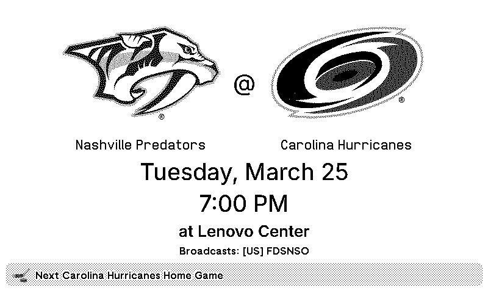

# trmnl-plugins

Repo containing plugins I created for my [trmnl](https://usetrmnl.com/) display.

## nhl-teams-next-game

This plugins uses [puckdex](https://github.com/cbdm/puckdex)'s [next API](https://puckdex.cbdm.app/docs) to display the next (home/away/any) game for the given team.  
The files in the folder are exported from trmnl's dashboard, but I first used the awesome [trmnl_preview](https://github.com/schrockwell/trmnl_preview) repo to understand how to get the data into the display.

Sample screenshot:  

## footcal-next-game

This plugins uses [footcal](https://github.com/cbdm/footcal)'s [next API](https://github.com/cbdm/footcal/blob/68f5302e244e1f5a523e1dce0cbd1ccba6b920e3/footcal/app.py#L131) to display the next game for the given team or competition.

Sample screenshot:  

